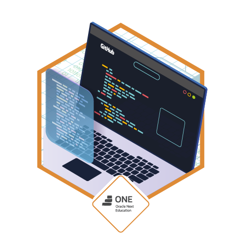

<h1 align="center">
  <a href="https://git.io/typing-svg">
    
  </a>
</h1>

```bash
$ whoami
> giovanne@cybersecurity

$ cat profile.txt
> Learning: SC-900 · AI900 · AZ900 · LetsDefend
> Focus: Information Security | GRC | DLP
> Frameworks:  NIST CSF · ISO 27001 · CIS Controls
> References:  OWASP Top 10 · MITRE ATT&CK · CIA Triad
```

## 💻 Languages and Tools

**🛡️ Cyber / Security**
<p>
  
  <br>
  <br>
  <span>More:</span><br><br>
  
  
  
  
  
</p>

**💻 Languages**
<p>
  
</p>

**🛠️ Infrastructure & General**
<p>
  
</p>

## 🌐 Connect With Me
<p>
  <a href="https://www.linkedin.com/in/giovanne-pagano/" target="_blank">
    
</a>
    <a href="mailto:giovanne3282@gmail.com" target="_blank">
    
</a>
</p>

## 🥇 Certifications
<p align="center">
  
  
  
</p>
